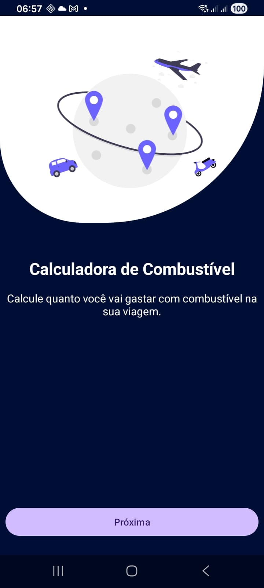
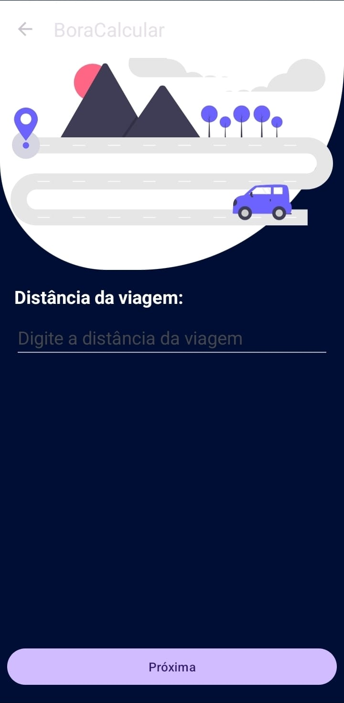
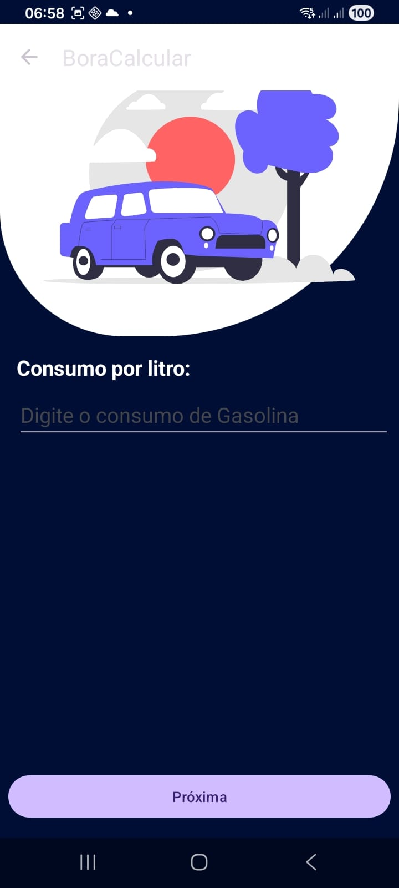
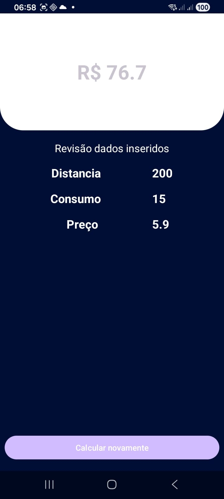
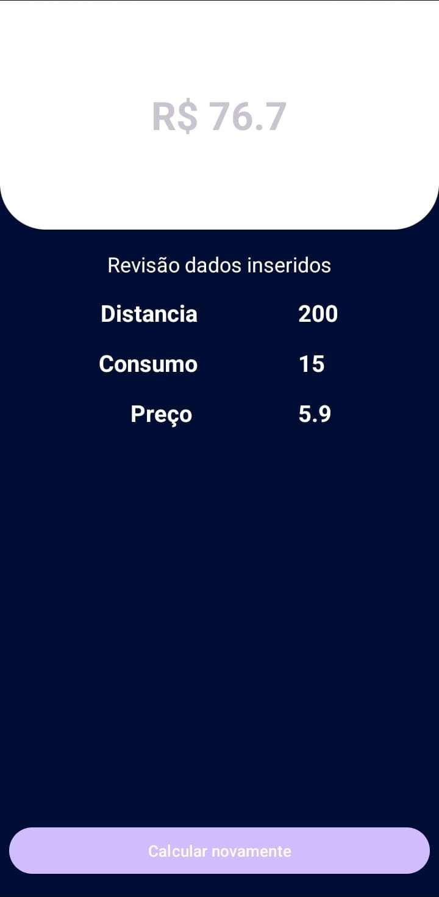

# 📱 BoraCalcular — Primeiro App Android

Projeto desenvolvido durante o desafio **"Criando seu primeiro App em 10 dias"**, realizado pela comunidade **Escola Nova Era Tech**.

O **BoraCalcular** é um aplicativo Android desenvolvido para calcular o custo de uma viagem com base na distância percorrida, consumo do veículo e preço do combustível.

Este projeto representa um dos meus primeiros passos no desenvolvimento mobile utilizando **Kotlin e Android**.

---

## 🎯 Sobre o projeto

A proposta do desafio foi desenvolver um aplicativo Android em 10 dias, colocando em prática os conhecimentos adquiridos durante os estudos.

No **BoraCalcular**, o usuário informa:

- 🚗 Distância que pretende percorrer
- ⛽ Consumo do veículo em km/l
- 💰 Preço do combustível

A aplicação realiza o cálculo e apresenta o valor estimado necessário para a viagem.

---

## 📱 Screenshots

### Tela inicial 

### Tela de entrada de dados

<table>
  <tr>
    <td></td>
    <td></td>
    <td></td>
  </tr>
</table>

### Tela de resultado

---

## 🛠️ Tecnologias utilizadas

- **Kotlin**
- **Android Studio**
- **LinearLayout**
- **ImageView**
- **TextView**
- **Toolbar**

---

## 📚 Conceitos praticados

Durante o desenvolvimento do projeto, coloquei em prática:

- Criação de uma aplicação Android
- Construção de interfaces utilizando XML
- Organização de componentes com `LinearLayout`
- Utilização de `ImageView` para imagens
- Utilização de `TextView` para apresentação de informações
- Implementação de `Toolbar`
- Entrada e manipulação de dados
- Operações matemáticas em Kotlin
- Navegação entre telas
- Desenvolvimento de uma aplicação funcional

---

## 🧮 Exemplo de cálculo

Considerando:

**Distância:** 200 km  
**Consumo:** 15 km/l  
**Preço:** R$ 5,90/l

O aplicativo realiza o cálculo:

**200 ÷ 15 = 13,33 litros**

**13,33 × R$ 5,90 ≈ R$ 78,67**

O objetivo é permitir que o usuário tenha uma estimativa rápida do custo de combustível antes de realizar uma viagem.

---

## 🚀 Desafio Escola Nova Era Tech

Este projeto foi desenvolvido como parte do desafio **"Criando seu primeiro App em 10 dias"**, promovido pela comunidade **Escola Nova Era Tech**.

Foi uma experiência importante para transformar os conhecimentos estudados em prática e começar a construir meu portfólio de projetos Android.

---

## 👨‍💻 Autor

**Diogo Alves**

Estudante de **Análise e Desenvolvimento de Sistemas**, atualmente estudando **Kotlin e desenvolvimento Android**, com foco em evoluir através de projetos práticos.

---

⭐ Este projeto representa o início da minha jornada no desenvolvimento mobile.
